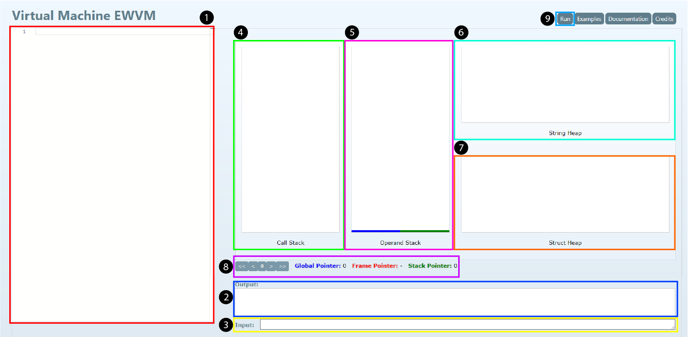

# EWVM Documentation
- By: Rafael Santos Fernandes
- Last Modified: 2025-04-09 17:03:47

## Preamble
This document is an alternative documentation to the one present on the [original EWVM project](https://ewvm.epl.di.uminho.pt/manual), created to be more comprehensive and accurate to the virtual machine's behavior. It is not officially endorsed nor maintained by the original authors of the project.

## Glossary
Throughout this document a number of concepts and abbreviatures are used that might not be understandable by the surrounding context alone. Following, a list of some of those concepts is provided:
- `Global Pointer`: The Global Pointer always points to the base of the `Operand Stack` and cannot be modified. It can be accessed through ***`PUSHGP`*** and is a useful shorthand for address-wise operations that mutate the global scope of the program. Often abbreviated as `GP`. 
- `Frame Pointer`: The Frame Pointer points to the base of the current scope on the `Operand Stack`. It changes on procedure calls and returns from said calls. Often abbreviated as `FP`.
- `Stack Pointer`: The Stack Pointer always points to the top of the stack and is modified by any operation that modifies the `Operand Stack`. It can be used as a quick pointer for address-wise operations. Often abbreviated as `SP`.
- `Program Counter`: The Program Counter is a register that keeps track of the current instruction. It can be directly modified through ***`JUMP`*** operations, but every instruction increments the program counter implicitly (except for procedure-related and jump operations, that can semi-arbitrarily change the program counter). It cannot be directly accessed.
- `Operand Stack`: The Operand Stack is the main stack used by a program. It stores the operands for any operation as well as the scope for every procedure in the program, pushing and popping them from the top. Often abbreviated as `stack`.
- `Call Stack`: The Call Stack is a parallel stack used by a program to keep track of scope changes through ***`CALL`*** operations. Every procedure call stores the previous scope's frame pointer and program counter, to be used by a ***`RETURN`*** call to return from the call and continue the original control flow. Contrary to the `Operand Stack`, it pushes and pops elements to and from the bottom.
- `String Heap`: The String Heap is a separated heap used exclusively to store string values. It must be accessed through `string addresses` stored on the `Operand Stack` beforehand.
- `Struct Heap`: The Struct Heap is a separated heap used to store blocks of compartmentalized data cells laid out adjacently. It must be accessed through `struct addresses` stored on the `Operand Stack` beforehand. Individual cells on a given block can be accessed by offseting relative to the base `struct address` of that block (***SEE: `PADD`***).
- `Address`: An Address is a pointer to a given value on the `Operand Stack`, the heaps or the program code itself. It is used to access larger data blocks by certain operations (such as IO Operations). It is often prefixed by it's associated data structure (`string` for the `String Heap`, `struct` for the `Struct Heap`), and is visually represented on the editor by an associated prefix. If a prefix is ommited, the operation accepts any address from any source.

## Operators

### Base Operations
Base operations are all operations that fall on the category of "basic operations", such as arithmetic operations (both mathematical and pointer-wise), basic string manipulation, and logic operations.

#### Integer Operations
- `ADD`: Pops the integer values `a` and `b` from the top of the `Operand Stack` and pushes the value `a + b` to the stack.
- `SUB`: Pops the integer values `a` and `b` from the top of the `Operand Stack` and pushes the value `a - b` to the stack.
- `MUL`: Pops the integer values `a` and `b` from the top of the `Operand Stack` and pushes the value `a * b` to the stack.
- `DIV`: Pops the integer values `a` and `b` from the top of the `Operand Stack` and pushes the value `a / b` to the stack.
- `MOD`: Pops the integer st structured block from tvalues `a` and `b` from the top of the `Operand Stack` and pushes the value `a % b` to the stack.
- `NOT`: Pops the integer value `a` from the top of the `Operand Stack` and pushes the value `n = 0` to the stack.
- `INF`: Pops the integer values `a` and `b` from the top of the `Operand Stack` and pushes the value `a < b` to the stack as a boolean integer.
- `INFEQ`: Pops the integer values `a` and `b` from the top of the `Operand Stack` and pushes the value `a <= b` to the stack as a boolean integer.
- `SUP`: Pops the integer values `a` and `b` from the top of the `Operand Stack` and pushes the value `a > b` to the stack as a boolean integer.
- `SUPEQ`: Pops the integer values `a` and `b` from the top of the `Operand Stack` and pushes the value `a >= b` to the stack as a boolean integer.

#### Float Operations
- `FADD`: Pops the real number values `a` and `b` from the top of the `Operand Stack` and pushes the value `a + b` to the stack.
- `FSUB`: Pops the real number values `a` and `b` from the top of the `Operand Stack` and pushes the value `a - b` to the stack.
- `FMUL`: Pops the real number values `a` and `b` from the top of the `Operand Stack` and pushes the value `a * b` to the stack.
- `FDIV`: Pops the real number values `a` and `b` from the top of the `Operand Stack` and pushes the value `a / b` to the stack.
- `FINF`: Pops the real number values `a` and `b` from the top of the `Operand Stack` and pushes the value `a < b` to the stack as a boolean integer.
- `FSIN`: Pops the real number value `a` from the top of the `Operand Stack` and pushes the value `sin(a)` to the stack.
- `FCOS`: Pops the real number value `a` from the top of the `Operand Stack` and pushes the value `cos(a)` to the stack.
- `FINFEQ`: Pops the real number values `a` and `b` from the top of the `Operand Stack` and pushes the value `a <= b` to the stack as a boolean integer.
- `FSUP`: Pops the real number values `a` and `b` from the top of the `Operand Stack` and pushes the value `a > b` to the stack as a boolean integer.
- `FSUPEQ`: Pops the real number values `a` and `b` from the top of the `Operand Stack` and pushes the value `a >= b` to the stack as a boolean integer.

#### Address Operations
- `PADD`: Pops an integer value `o` and an address `a` from the top of the `Operand Stack` and pushes the address `a + o` to the stack.

#### String Operations
- `CONCAT`: Pops the string addresses `a` and `b` from the top of the `Operand Stack` and pushes the value concatenated strings to the string heap, and it's corresponding address to the stack.
- `CHRCODE`: Pops the string address `a` from the top of the `Operand Stack` and pushes the UTF-16 code unit of the first character to the stack.
- `STRLEN`: Pops the string address `a` from the top of the `Operand Stack` and pushes tit's length to the stack.
- `CHARAT`: Pops an integer value `i` and the string address `a` from the top of the `Operand Stack` and pushes the UTF-16 code unit of the character at the index `i` of the string to the stack.

#### Binary Operations
- `CHECK lb ub`: Checks if the integer value at the top of the `Operand Stack` is within the interval `[lb, ub]`. If it succeeds, no output is returned. If it fails, an error is thrown.
  - **Arguments:**
    - `lb`: An immediate integer value.
    - `ub`: An immediate integer value.
  - ***SEE: `JZ`***
- `AND`: Pops a numeric value `a` and a numeric value `b` from the `Operand Stack` and pushes the result of `a && b`. For both operands, any value different than 0 is treated as `true` and 0 is treated as `false`.
    - ***SEE: `JZ`***
- `OR`: Pops a numeric value `a` and a numeric value `b` from the `Operand Stack` and pushes the result of `a || b`. For both operands, any value different than 0 is treated as `true` and 0 is treated as `false`.
    - ***SEE: `JZ`***
- `EQUAL`: Pops a value `a` and a value `b` from the `Operand Stack` and pushes the result of `a == b`.

#### Conversion Operations
- `ATOI`: Pops a string address from the `Operand Stack`, converts it's correspondent value on the `String Heap` to an integer, and pushes the result to the stack. If the string is not a valid integer, an error is thrown.
- `ATOF`: Pops a string address from the `Operand Stack`, converts it's correspondent value on the `String Heap` to a real number, and pushes the result to the stack. If the string is not a valid real number, an error is thrown.
- `ITOF`: Pops an integer value from the `Operand Stack`, converts it to a real number value and pushes the result to the stack.
- `FTOI`: Pops a real number value from the `Operand Stack`, converts it to a integer value and pushes the result to the stack.
- `STRI`: Pops an integer value from the `Operand Stack`, converts it to a string value, pushes the result to the `String Heap` and pushes the corresponding address to the stack.
- `STRF`: Pops a real number value from the `Operand Stack`, converts it to a string value, pushes the result to the `String Heap` and pushes the corresponding address to the stack.
# 

### Data Manipulation
Data manipulation operations are operations whose primary purpose is manipulating the `Operand Stack` and/or the heaps. They can add, remove and manipulate the values. As a rule of thumb, `PUSH` operations are ***read*** operations and `STORE` operations are ***write*** operations.

#### Adding to the `Operand Stack`
- `PUSHI i`: Pushes an integer `i` to the top of the `Operand Stack`.
  - **Arguments:**
    - `i`: An immediate integer value.
- `PUSHN n`: Pushes the NIL (0) immediate integer value `n` times.
  - **Arguments:**
    - `n`: An immediate integer value.
- `PUSHF r`: Pushes a real number `r` to the top of the `Operand Stack`.
  - **Arguments:**
    - `r`: An immediate real number value.
- `PUSHS s`: Pushes a string `s` to the `String Heap` and pushes the resulting address to the top of the `Operand Stack`.
  - **Arguments:**
    - `s`: An immediate string value.
- `PUSHG i`: Pushes an integer found at the offset `i` from the `GP` to the top of the `Operand Stack`.
  - **Arguments:**
    - `i`: An immediate integer value.
  - **Example:**
    - Initial state:
      | Operand Stack    | GP  | FP  |
      |:-----------------|:----|:----| 
      | [10, 20, 30, 40] |  0  |  0  |
    - Command: `pushg 2`
    - End state:
      | Operand Stack        | GP  | FP  |
      |:---------------------|:----|:----| 
      | [10, 20, 30, 40, 30] |  0  |  0  |
- `PUSHL i`: Pushes an integer found at the offset `i` from the `FP` to the top of the `Operand Stack`.
  - **Arguments:**
    - `i`: An immediate integer value.
  - **Example:**
    - Initial state:
      | Operand Stack  | GP  | FP  |
      |:---------------|:----|:----| 
      | 10, 20, 30, 40 |  0  |  2  |
    - Command: `pushl 0`
    - End state:
      | Operand Stack      | GP  | FP  |
      |:-------------------|:----|:----| 
      | 10, 20, 30, 40, 30 |  0  |  2  |
- `PUSHSP`: Pushes the current value of the `SP` to the top of the `Operand Stack` as an address.
  - ***SEE: `LOAD`***.
- `PUSHFP`: Pushes the current value of the `FP` to the top of the `Operand Stack` as an address.
  - ***SEE: `LOAD`***.
- `PUSHGP`: Pushes the current value of the `GP` to the top of the `Operand Stack` as an address.
  - ***SEE: `LOAD`***.
- `PUSHST i`: Pushes the address of a struct on the `Struct Heap` at a given index `i` to the top of the `Operand Stack`.
  - **Arguments:**
    - `i`: An immediate integer value.
- `LOAD o`: Pops an address (`a`) from the top of the `Operand Stack` and pushes to the top of the `Operand Stack` the value found at `a + o`.
  - **Arguments:**
    - `o`: An immediate integer value.
  - **Example:**
    - Initial state:
      | Operand Stack       | GP  | FP  |
      |:--------------------|:----|:----| 
      | 10, 20, 30, stack#0 |  0  |  2  |
    - Command: `load 1`
    - End state:
      | Operand Stack  | GP  | FP  |
      |:---------------|:----|:----| 
      | 10, 20, 30, 20 |  0  |  2  |
- `LOADN`: Pops an integer offset (`o`) and an address (`a`) from the top of the `Operand Stack` and pushes to the top of the `Operand Stack` the value found at `a + o`.
  - Functionally identical to ***`LOAD`***, but takes the arguments from the `Operand Stack`.
  - **Example:**
    - Initial state:
      | Operand Stack          | GP  | FP  |
      |:-----------------------|:----|:----| 
      | 10, 20, 30, stack#0, 2 |  0  |  2  |
    - Command: `loadn`
    - End state:
      | Operand Stack  | GP  | FP  |
      |:---------------|:----|:----| 
      | 10, 20, 30, 30 |  0  |  2  |
- `DUP n`: Duplicates the value found at the top of the `Operand Stack` `n` times, pushing them all to the top of the `Operand Stack`.
  - **Arguments:**
    - `n`: An immediate integer value.
- `DUPN`: Pops an integer value (`n`) from the `Operand Stack` and duplicates the value found at the top of the `Operand Stack` `n` times, pushing them all to the top of the `Operand Stack`.
  - Functionally identical to ***`DUP`***, but takes the argument from the `Operand Stack`.

#### Taking from `Operand Stack`
- `POP n`: Removes the first `n` values from the top of the `Operand Stack`.
  - **Arguments:**
    - `n`: An immediate integer value.
- `POPN`: Pops an integer value (`n`) from the `Operand Stack` and removes the first `n` values from the top of the `Operand Stack`.
  - Functionally identical to ***`POP`***, but takes the argument from the `Operand Stack`.

#### Manipulating the `Operand Stack`
- `STOREL i`: Pops the a value from the top of the `Operand Stack` and stores it at `FP + i`.
  - **Arguments:**
    - `i`: An immediate integer value.
  - **Example:**
    - Initial state:
      | Operand Stack        | GP  | FP  |
      |:---------------|:----|:----| 
      | 10, 20, 30, 40 |  0  |  1  |
    - Command: `storel 1`
    - End state:
      | Operand Stack        | GP  | FP  |
      |:---------------|:----|:----| 
      | 10, 20, 40     |  0  |  1  |
- `STOREG i`: Pops the a value from the top of the `Operand Stack` and stores it at `GP + i`.
  - **Arguments:**
    - `i`: An immediate integer value.
  - **Example:**
    - Initial state:
      | Operand Stack        | GP  | FP  |
      |:---------------|:----|:----| 
      | 10, 20, 30, 40 |  0  |  1  |
    - Command: `storeg 1`
    - End state:
      | Operand Stack        | GP  | FP  |
      |:---------------|:----|:----| 
      | 10, 40, 30     |  0  |  1  |
- `STORE i`: Pops a value `v` and an address `a` from the top of the `Operand Stack` and stores the value of `v` at `a + i`.
  - **Arguments:**
    - `i`: An immediate integer value.
  - **Example:**
    - Initial state:
      | Operand Stack           | GP  | FP  |
      |:------------------------|:----|:----| 
      | 10, 20, 30, stack#1, 40 |  0  |  1  |
    - Command: `store 1`
    - End state:
      | Operand Stack  | GP  | FP  |
      |:---------------|:----|:----| 
      | 10, 20, 40     |  0  |  1  |
- `STOREN`: Pops a value `v`, an integer offset and an address `a` from the top of the `Operand Stack` and stores the value of `v` at `a + i`.
  - Functionally identical to ***`STORE`***, but takes all arguments from the `Operand Stack`.
  - **Arguments:**
    - `i`: An immediate integer value.
  - **Example:**
    - Initial state:
      | Operand Stack              | GP  | FP  |
      |:---------------------------|:----|:----| 
      | 10, 20, 30, stack#1, 1, 40 |  0  |  1  |
    - Command: `storen`
    - End state:
      | Operand Stack  | GP  | FP  |
      |:---------------|:----|:----| 
      | 10, 20, 40     |  0  |  1  |
- `SWAP`: Pops a value `a` and a value `b` from the `Operand Stack` and pushes them back in their reverse order.
  - **Example:**
    - Initial state:
      | Operand Stack  | GP  | FP  |
      |:---------------|:----|:----| 
      | 10, 20, 30, 40 |  0  |  1  |
    - Command: `swap`
    - End state:
      | Operand Stack  | GP  | FP  |
      |:---------------|:----|:----| 
      | 10, 40, 40, 30 |  0  |  1  |

#### Heap Operations
- `ALLOC n`: Allocates a memory block with a size of `n` units in the `Struct Heap` and pushes it's corresponding address to the `Operand Stack`.
  - **Arguments:**
    - `n`: An immediate integer value.
- `ALLOCN`: Pops an integer value `n` from the top of the `Operand Stack` and allocates a memory block with a size of `n` units in the `Struct Heap` and pushes it's corresponding address to the `Operand Stack`.
  - Functionally identical to ***`ALLOC`***, but takes the argument from the `Operand Stack`.
- `FREE`: Pops a struct address value `a` from the top of the `Operand Stack` and frees the allocated block associated with address on the `Struct Heap`. Attempting to free an already freed block will result in a runtime error being thrown.
- `POPST`: Pops the struct at the top of the `Struct Heap`. It's value is discared and all pointers to it will become invalid, but not cleaned up.

### Input-Output Operations
Input-Output operations (abbreviated as IO Operations) are operations that read user input or write data to the output buffer.

- `WRITEI`: Pops an integer from the top of the `Operand Stack` and prints it.
- `WRITEF`: Pops a real number from the top of the `Operand Stack` and prints it.
- `WRITES`: Pops a string address from the top of the `Operand Stack` and prints it's associated value on the `String heap`.
- `WRITELN`: Prints a new line.
- `WRITECHR`: Pops an integer from the top of the `Operand Stack` and prints it's corresponding UTF-16 character.
- `READ`: Reads a string from the keyboard, stores it in the `String heap` and pushes it's address to the top of the `Operand Stack`.

### Control Operations
Control operations are operations that alter the control flow of the program. Can be used to create conditionals, loops and procedures.

#### Program Counter Register Alteration
- `PUSHA label`: Pushes the address corresponding to the `label` to the top of the `Operand Stack`.
  - ***SEE: `CALL`***
  - **Arguments:**
    - `label`: An existing label. If the label does not exist, a grammar error is thrown.
- `JUMP label`: Sets the program counter to the address of the instruction immediately after the `label`. Does not alter the `Operand Stack`.
  - **Arguments:**
    - `label`: An existing label. If the label does not exist, a grammar error is thrown.
- `JZ label`: Pops a value (`v`) from the top of the `Operand Stack`. If `v == 0`, sets the program counter to the address of the instruction immediately after the `label`. Otherwise, the current flow is followed with no additional changes.
  - **Arguments:**
    - `label`: An existing label. If the label does not exist, a grammar error is thrown.

#### Procedures
- `CALL`: Pops a code address (`a`) from the top of the `Operand Stack`, pushes the current program counter and `frame pointer` to the `Call Stack` and finally sets the program counter to `a` and the `frame pointer` to the current `stack pointer`.
  - ***SEE: `PUSHA`***
- `RETURN`: Pops the parent flow's program counter and `frame pointer`, restores them and continues the parent flow. Leftover values in the `Operand Stack` are ***NOT*** cleaned up.

#### Lifecycle Operations
- `START`: Sets the `frame pointer` to the current `stack pointer`.
- `NOP`: No OPeration. Has no effect.
- `ERR msg`: Throws an error with the message `msg` and immediately halts the program execution.
  - **Arguments:**
    - `msg`: An immediate string value.
- `STOP`: Halts the program execution immediately.
# 

## Editor
The VM can be accessed through a [web page editor](https://ewvm.epl.di.uminho.pt) that provides step-by-step execution of the program, as well as error reporting. The page itself is divided into several components:

1. The `Code Editor`, located on the left side of the page, can be used to hold the program code for execution. It also indicates the currently executed line, as well as the line where a given error was reported, or a given output was printed to the output buffer.
2. The `Output Buffer`, located on the bottom right side of the page, will hold any errors that may arise from the interpretation of the code present on the editor, as well as all the output that the program produces. Clicking on any character on the buffer will indicate on the code editor the line that originated the output at that position. That behavior is also present for most errors, safe for errors that happen at an early stage of the interpretation process.
3. The `Input Buffer`, located below the `Output Buffer`, and hidden by default, is revealed every time the execution encounters a ***`READ`*** instruction, which will halt execution until the user inserts an input line into the input buffer. The input will only be accepted upon hitting the `Enter` key on the keyboard, which will refresh the page and continue the program from where the blocking operation left off, with the input value added to the `String Heap`.

The `Control Panel`, located above the `Output Buffer`, is the section of the page where the controls and state visualization for the current program are located. It, in turn, is split into multiple components itself:  

4. The `Call Stack`, located on the left side, contains the state required for backtracking prodecure calls throughout the program's lifetime. Every line is divided in half, and holds the previous `Program Counter` on the left-hand side, and the previous `Frame Counter` on the right-hand side.
5. The `Operand Stack`, located immediately to the right of the `Call Stack`, contains the main state of the program, holding every value and address used by most instructions. Numeric values are shown as-is (e.g. `10`, `3.1415`), while addresses are shown in the form `<source>#<position>`, where the source is:
    - `code`: When the address points to a position of a label on the program (***SEE: `PUSHA`***).
    - `stack`: When the address points to a position on the `Operand Stack` (***SEE: `PUSHSP`, `PUSHFP`, `PUSHGP`***).
    - `string`: When the address points to a position on the `String Heap` (***SEE: `PUSHS`***).
    - `struct`: When the address points to a position on the `Struct Heap` (***SEE: `PUSHST`***).
6. The `String Heap`, located immediately to the right of the `Operand Stack` and aligned to the top of the section, contains the string values that are used throughout the lifetime of the program. The values are represented as-is (e.g. `Lorem ipsum dolor sit amet.`).
7. The `Struct Heap`, located immediately to the right of the `Operand Stack` and aligned to the bottom of the section, contains the memory blocks that are alocated at a given time during the program's lifetime. The values are represented as contiguous cells, each holding a numeric or string address.
8. The `Program Controls`, located immediately below all other componments of the `Control Panel`, holds four buttons distributed equally around the current `Program Counter` display. To their right side are the displays for the current `Global Pointer`, `Frame Pointer` and `Stack Pointer`. The `FP` will start off with the value `-`, which is to be interpreted as nil (0), while the `SP` will start off with the value `0`. The `GP` should always be `0`. The control buttons step the `PC` forwards or backwards:
   - `<<`: Resets the `PC` back to 0.
   - `<`: Decrements the `PC` by one unit, except when backtracking from a procedure call, on which case, it will be set to the `PC` stored at the bottom entry on the `Call Stack`.
   - `>`: Increments the `PC` by one unit, except when executing a `JUMP` instruction or a procedure call, on which case it will be set to the target `PC` as determined by each instruction (***SEE: `JUMP`, `JZ`, `CALL`***).
   - `>>`: Sets the `PC` to the end of the program.
9. The `Run` button, located on the top right side of the page takes the current program code on the `Code Editor` and executes it. Doing so will refresh the page and start off with the `PC` set to 0, or a compile-time error displayed right way on the `Output Buffer`.